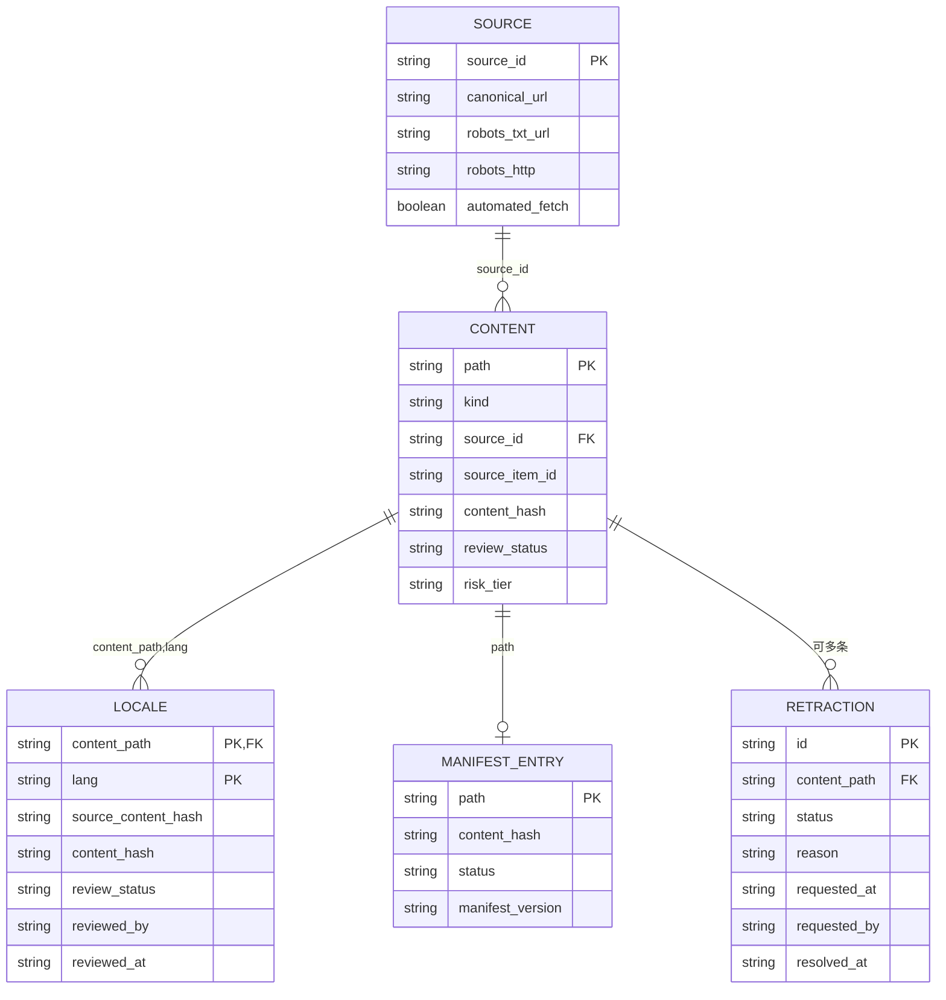
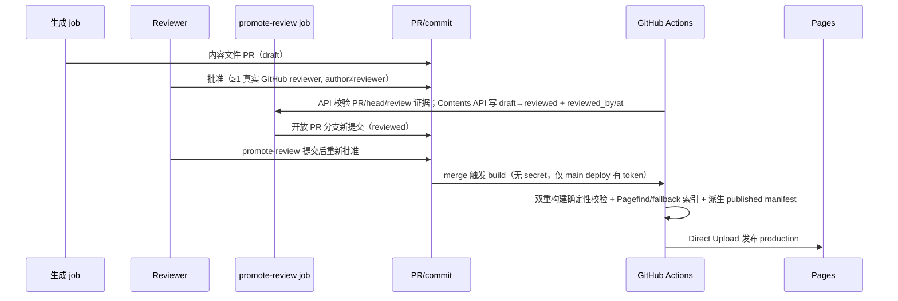
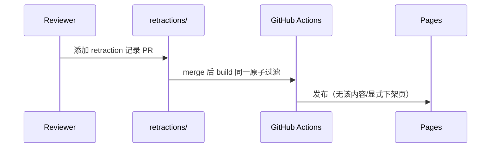
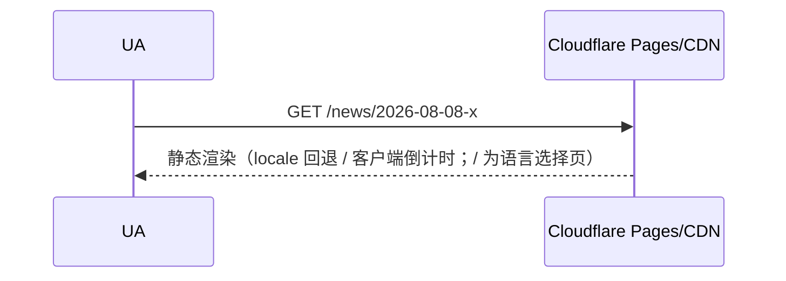
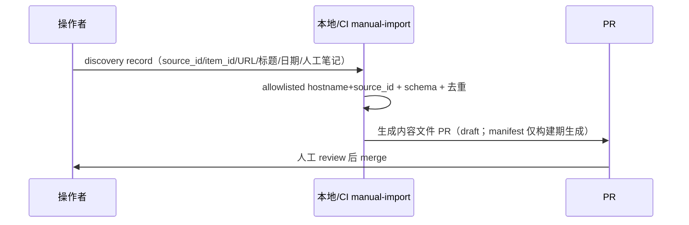

# momoko.pro — 整站技术实现方案

状态: task #3 设计候选 v1.6（修订版，待 @momoko 验收）。不写生产代码；只产出可实施设计。

范围: 非官方 fan site（周防桃子 / ミリシタ idol master million live）。三语 zh/ja/en。
域名: 用户已有 `momoko.pro`。

**MVP 锁定**：Git canonical 内容 + GitHub Actions 构建/调度 + **Cloudflare Pages 静态托管（GitHub Actions Direct Upload 为唯一部署面）**。**无运行时 Worker / KV / Cron Trigger / D1 / Queues / R2 / Vectorize / Pages Functions**。AI 是 CI/本地任务的 provider-neutral 可选依赖，**未选定供应商前不标"启用"**。

**交付物**：`design.md`（本文）+ `adr.md`（ADR/待决策）+ `sources.md`（人类证据说明）+ `config/sources.json`（机器可读来源配置）+ `schemas/*.json`（JSON Schema）+ `mvp-tests.md` + `phases.md`。

---

## 0. 设计原则

- **零成本优先**：只使用官方免费额度 + 已拥有的 `momoko.pro`。**"零成本"不得用跳过备份、安全或可撤回性来换取**。任何付费服务引入前必须人工批准。
- **来源可信**：只允许官方/本人/经纪事务所/主办方来源；**X 用人工维护的普通官方 permalink 卡片**（只存 account/date/permalink/人工原创说明，**不复制 post 文本/图片**，不 embed/API/抓取，见 sources.md §2）；内容源在存在公开 robots/terms 证据前不自动抓取，仅人工发现/录入；不托管官方图像/Logo/完整台词/歌词/音频；不做声线克隆。
- **来源验证**：MVP 无加密签名；"来源签名"仅指 **allowlisted HTTPS hostname + source_id** 校验。
- **可追溯**：每篇内容保留 source URL、发布时间、内容哈希、模型/提示版本、审核人、变更历史。
- **外部输入一律不可信**：所有外部 URL/文本（含人工粘贴的正文）按 prompt-injection 处理（隔离渲染 + 不把外部文本拼进系统提示）。
- **三语与审核不撒谎**：翻译与人工审核状态显式可查；原文变化后旧译文必须标记失效，不得继续显示为已审核。
- **无评论/投稿/登录用户**（MVP）：关闭所有 UGC 面。
- **风险分级发布（T0/T1/T2）**：
  - **T0 可自动生成文件/PR**：人工维护的生日/周年结构化事实；allowlist 官方源的原始标题、日期、permalink 卡片（经 schema/去重/allowlisted hostname+source_id 校验，无 AI 改写）。**T0 仍需人工 review+merge，MVP 不自动合并/发布任何新内容**（见 §3.3 与 ADR-03）。
  - **T1 默认草稿**：任何 AI 摘要或翻译默认 draft；只有某 source×content_type 积累抽样质量证据后，才可由人显式开启，且保留抽检、熔断与一键撤回。
  - **T2 永久人工**：人物/声优、健康、争议、纠错/下架、来源冲突、法律/版权、悼念以及模型不确定内容。

---

## 1. 信息架构与路由

### 1.1 页面清单

| 路由 | 页面 | MVP? |
|---|---|---|
| `/` | 语言选择页（x-default）或固定静态重定向到默认语言 | ✅ |
| `/news` `/news/[id]` | 新闻归档 + 详情 | ✅ |
| `/wiki/character` | 角色百科（设定档案） | ✅ |
| `/wiki/songs` | 歌曲/CD 列表 | ✅ |
| `/wiki/live` | Live 出场时间线 | ✅ |
| `/anniversaries` | 纪念日（生日/周年/新歌发布日） | ✅ |
| `/search` | 站内搜索 | ✅ |
| `/about` | About/来源/AI 使用/纠错与下架政策 | ✅ |
| `/page/privacy` `/page/terms` | 隐私与条款 | ✅ |

以后版本: 图片画廊、时间线可视化、订阅提醒、RSS 输出。（**不包含台词库**——不托管/再现完整台词。）

### 1.2 三语路由

- `/zh/...`, `/ja/...`, `/en/...`。`/` 为 **x-default 语言选择页**（无 Worker/Functions，**不做服务端 Accept-Language 读取**）或固定静态 302 到默认语言（如 `/ja`）。
- canonical（源语言/主要语言）+ alternate/hreflang（三语 + x-default）。

---

## 2. 实现技术栈（默认且可替换，ADR-11）

| 层 | 默认选择 | 版本/锁定 | 可替换条件 |
|---|---|---|---|
| 静态生成器 | **Astro** | 仓库 `pnpm-lock.yaml` 锁精确版本 | 无法满足三语/hreflang 或构建复杂度超阈值时另评 |
| 语言/runtime | **TypeScript**（Node ≥ 20） | `engines` 字段 + lockfile | 团队主导语言变更需 ADR |
| 包管理器 | **pnpm** | `pnpm-lock.yaml` 强制提交，CI `frozen-lockfile` | 需 ADR |
| Schema 校验 | **JSON Schema + Ajv** | 版本锁定于 lockfile | 需 ADR |
| 单元测试 | **Vitest** | 同上 | 需 ADR |
| 浏览器测试 | **Playwright** | 同上 | 需 ADR |
| 搜索 | **Pagefind（build-time）** | 见 §7.2 验收夹具 + fallback | ADR-05 |
| Pages 部署 | **GitHub Actions Direct Upload**（wrangler） | 见 §8.3（唯一部署面） | ADR-06 |
| AI 摘要/翻译 | provider-neutral（未选） | 不锁定；未选前不启用 | ADR-08 |

---

## 3. 内容真相与审核状态机

### 3.1 唯一真相源（无双写）

- **canonical**：`content/**` 文件（frontmatter 含 `review_status` 等字段）+ `content/retractions/**` + `config/sources.json` + `config/reviewers.json`。**由人/受控 job 编辑**。
- **`manifest.json` 不提交仓库**：由校验器在**构建期全量生成到 dist**，是 deterministic build artifact；确定性用**双重构建比对**（同一内容构建两次，产物逐字节一致）验证。**无"与已提交 manifest 比对"**——仓库内不存在 manifest。
- `docs/sources.md` 只做人类证据说明；机器配置以 `config/sources.json` 为准（schema: `schemas/source.schema.json`）。

### 3.2 状态机与写入者（可执行模型）

Git 上无法在 merge commit 之后回写 canonical 状态，因此锁定的可执行模型为：

| 字段 | 谁写 | 何时写 | 落点 |
|---|---|---|---|
| `review_status: draft` | 生成 job（manual-import / ai-draft） | 创建内容/译文文件时 | **开放 PR 分支** canonical 文件 |
| `review_status: reviewed` | **promote-review job**（受控，default-branch-owned 可信 workflow） | PR 经真实 GitHub reviewer 批准、API 校验 PR/head/review 证据后，job 用 Contents API 在该 PR head 写 `reviewed` + 非空 `reviewed_by/reviewed_at`，形成新提交 | 开放 PR 分支 canonical 文件 |
| `review_status: stale` | **stale-check job**（受控） | 原文 content_hash 变化时，原子地把三语 reviewed 译文置 stale | PR 分支 canonical 文件 → 合并后生效 |
| `retraction` | **retraction job**（受控） | `content/retractions/**` 合并时，同一 build 原子过滤该 content | canonical + build 过滤 |
| commit author | GitHub | 真实提交人；**不等于 reviewer** | — |
| `published`（**派生，不在 canonical enum**） | build（派生） | main 上 `reviewed` 内容经 merge+构建 → manifest 记 `published`；**不回写 canonical** | dist/manifest（build artifact） |

> **canonical `review_status` enum**：`draft | reviewed | stale | retracted`。**`published` 不在 canonical enum**——它只作为 build 期派生的 manifest 状态存在；schema 对 canonical 的 `published` 直接拒绝（见 `schemas/content.schema.json` / `locale.schema.json` 与正反用例）。
>
> **`reviewed` 条件约束**：schema 用条件约束强制 `review_status=reviewed` 时 `reviewed_by` 与 `reviewed_at` 必须存在且非空；缺失/为 null 即校验失败。

> **正/反状态转移表**（CI 校验，非法转移 fail）：
> - 正：`draft → reviewed`（仅 promote-review 在开放 PR 写，且 reviewer/time 非空）；`reviewed → published`（main merge+构建派生）；`published → stale`（源变化，manifest 派生层）；`* → retracted`（下架，经 build 过滤）。
> - 反（禁止）：`reviewed → draft`、`published → draft`、跳过 `draft` 直接 `published`、同状态重复（幂等除外）、**非 promote-review job 直接写 `reviewed`**。

**promote-review 时序（可信执行面，default-branch-owned workflow）**：
1. 生成 job 以 `draft` 开 PR。
2. 真实 GitHub reviewer 在 PR 上 `APPROVE`。
3. **受控 `workflow_dispatch`**（由 maintainer 对固定 PR/head 触发，或等价的 default-branch-owned 可信事件）运行 `promote-review`：
   - 输入：`pr_number`、`head_sha`、`reviewer_handle`。
   - **只通过 GitHub API 校验**：PR 仍开放、`head.sha == head_sha`、存在该 reviewer 的 APPROVE review（author≠reviewer，reviewer ∈ `config/reviewers.json`）。
   - **绝不在 CI 中 checkout/执行 PR 分支脚本**；只用 Contents API 在该精确 head 的 content 文件上写 `reviewed`+`reviewed_by/reviewed_at` 并提交。
   - 最小权限：Contents API 写权限仅限该 PR head；并发/幂等：同一 head 重复触发只产生一次状态提交（以目标文件当前内容 hash 判断）。
   - 分支/作者限制：仅允许对 `config/reviewers.json` 内 reviewer 且 author≠reviewer 的 PR 生效。
4. 分支保护要求 bot 提交后重新满足 approval（GitHub 对 push 重置 review）。
5. reviewer 再次批准 → merge 到 main → build 派生 `published`。

**`published` 不回写 canonical**：canonical 永远最多 `reviewed`；`published` 只存在于 build 期 manifest（dist）。下次构建对 main 上 `reviewed` 内容重新派生 `published`，**不会回退**。

### 3.3 审核/发布规则（T0 保守化）

- 所有 merge 需 PR + review（main 禁直推，分支保护）。
- **T0 只可自动生成文件/PR，仍需人工 review + merge；MVP 不自动合并/发布任何新内容**。
- **required reviewer（真实 GitHub 身份）**：`config/reviewers.json` 只接受**真实 GitHub 登录名**（schema 拒绝空/重复 handle）。MVP 模型：PR 由 **GitHub App** 打开时，reviewer 为 `ariga39`（repo owner/App）；若未来允许人类自开 PR，则需要**第二个真实 GitHub reviewer**。**author 不能是自己 PR 的唯一 reviewer**。
- **promote-review 执行面**：受控 `workflow_dispatch`（default-branch-owned 可信 workflow）经 API 校验 PR/head/review 证据后用 Contents API 写 PR head；**不在 `pull_request` 代码路径上注入 secret，也绝不 checkout/执行未审 PR 脚本**（详见 §3.2 与 §8.3）。
- CI 校验 reviewer/merge 证据：`gh api` 读取 PR review（真实 GitHub review 对象）；promote-review 只对开放 PR 的精确 head 生效（不直推 main，不触发受保护分支）。
- 未来若要 T0 auto-merge：另开 ADR + 签名来源/独立批准门（MVP 不做）。

---

## 4. 来源与版权

- 只官方/本人/经纪事务所/主办方来源；**X 用人工维护的普通官方 permalink 卡片**（只存 account/date/permalink/人工原创说明，不复制 post 文本/图片）。
- 不托管官方图像/Logo/完整台词/歌词/音频；不做声线克隆。
- 来源机器配置：`config/sources.json`（S1–S5，全部 `automated_fetch=false`）。人类证据说明：`docs/sources.md`。
- Prompt-injection：外部正文隔离渲染 + 不进系统提示（覆盖人工粘贴与 future 抓取）。

### 4.1 X 产品决策（事实摘录，不做法律裁定）

- 事实：官方 Display Requirements "strongly encourage" 使用 embedded posts/timelines；X Developer Agreement §III.K 同时含对在 iframe 等嵌入机制中展示 X Content 的绝对禁止表述。**本设计不自行裁定其法律冲突，也不声称"embed 依赖 iframe 因此绝对禁止"。**
- 官方页（检索日期 2026-08-08）：https://docs.x.com/developer-terms/display-requirements 、https://docs.x.com/developer-terms/agreement 、https://docs.x.com/x-for-websites/embedded-posts/overview.md 。
- **产品决策（MVP）**：为避免许可解释、第三方内容与运行依赖，采用**普通官方 permalink 卡片**（纯链接，不 embed/API/抓取，不复制内容）。**未来启用 embed/API 必须先重新法律/条款评审并经人工批准**。

---

## 5. 内容管线（MVP：人工 discovery → schema → AI 草稿 → PR）

### 5.1 管线

```
人工发现/录入（discovery record）→ schema 校验/规范化 → 指纹去重 → (可选) AI 摘要/翻译草稿
  → 风险分级 → 生成 schema'd 内容文件 PR（draft）→ 人工 review → promote-review（受控 workflow_dispatch）写 reviewed
  → 重新批准 → merge 到 main → 构建（生成 dist+派生 manifest）→ 发布
```

- **MVP 无**：`daily-fetch`、网页抓取、抓取重试/退避/死信、raw page store、工具自行打开 URL。这些全部移到 future 条件分支（§5.3）。
- **discovery record**：人工提交 `{source_id, source_item_id, source_url, published_at, title, lang, note_hash, note}`（schema: `schemas/discovery-record.schema.json`，含唯一键必需字段）。note 为**人工撰写的事实笔记/明确批准的短摘录**；工具只校验/去重/规范化后生成 PR。
- **AI 输入边界（关键）**：MVP 不存页面正文，ai-draft **不能凭空摘要**。锁定输入=只消费**人工撰写的事实笔记或明确批准的短摘录**；**外部正文不进 repo、prompt log 或 artifact**；记录 source URL、note hash、模型/提示版本；输出恒 T1 draft。**工具不得自行打开 URL**。
- **T 分级**：T0（人工事实/卡片，无 AI 改写）→ 可自动生成文件+PR（仍人工 merge）；T1（AI 摘要/翻译）→ 默认 draft；T2 → 永久人工。
- **幂等/去重**：`(source_id, source_item_id, lang, content_hash)` 唯一键；去重后无变化则 PR 无 diff（静默）。
- **content_hash**：sha256 规范化字节序列（定义见 §6.4）；校验器比较。
- **元数据**：frontmatter 含 source URL/发布时间/hash/模型版本/审核人/变更历史。

### 5.2 任务（MVP 无自动抓取）

| 任务 | 触发 | 输入 | 输出 |
|---|---|---|---|
| `manual-import` | 人工运行（本地/CI manual） | discovery record | 校验通过的内容文件 PR（`draft`） |
| `ai-draft` | 人工运行（CI manual，可选） | 已 review 的源语言内容 + 人工事实笔记 | 译文/摘要草稿 PR（T1 draft） |
| `promote-review` | 受控 `workflow_dispatch`（default-branch-owned） | PR/head/review 证据（真实 GitHub reviewer、author≠reviewer） | Contents API 在 PR head 写 `draft→reviewed`+reviewer/time |
| `stale-check` | schedule/manual | 源 content_hash | reviewed 译文置 stale 的原子 PR |
| `retraction` | PR 合并 retractions/** | retraction record | canonical + 同 build 原子过滤 |
| `build`（含 index） | push / merge / schedule | content/ + config/ | 生成 dist（含 manifest）+ 搜索索引 → Pages

### 5.3 future：自动抓取条件分支（当前不实现）

仅当某来源取得公开 robots/terms 许可证据、经人工批准后才在 CI/受控本地任务中启用自动抓取；届时才引入重试/退避/死信/raw store 契约。

---

## 6. 数据模型（Git canonical：schema 化文件 + manifest）

### 6.1 Git 文件树（A–E 目录边界）

```
momoko.pro/
├── src/                        # A: 前端源码（Astro）— pages/components/styles
├── content/                    # A→D 共享只读；D 写 content.<lang>.md
│   ├── news/2026/<source>-<itemid>/index.md + content.{zh,ja,en}.md
│   ├── wiki/{character,songs,live}/<slug>/index.md
│   ├── anniversaries/<slug>.json
│   └── retractions/<id>.json
├── config/
│   ├── sources.json            # 来源配置（canonical，B 校验）
│   └── reviewers.json          # reviewer 允许名单（canonical 单来源）
├── schemas/*.json              # B: JSON Schema（含 manifest.schema.json）
├── tools/
│   ├── schema/**               # B: 校验/规范化/迁移/双重构建确定性
│   ├── ingest/**               # C: manual-import / discovery
│   └── editorial/**            # D: ai-draft / stale-check / retraction
├── tests/                      # E: 单元/集成（B/D 提供模块+契约）
├── e2e/                        # A: Playwright
├── .github/workflows/          # E 唯一拥有全部 workflow
├── .github/CODEOWNERS          # A–E 所有权（互斥）
├── package.json / pnpm-lock.yaml / tsconfig.json / astro.config.mjs
└── LICENSE-NOTICE.md
```

> owned files 边界（**互斥目录，无重叠**）：**A** 仅 `src/**`+`e2e/**`；**B** 仅 `schemas/**`+`tools/schema/**`+`config/*.json`（校验）+ `tools/schema/migrations/**`；**C** 仅 `tools/ingest/**`；**D** 仅 `content/*/content.<lang>.md`+`tools/editorial/**`；**E** 仅 `.github/workflows/**`+`.github/CODEOWNERS`+`tests/**`+CI/CD 配置。**所有 workflow 文件只归 E**；B/C/D 只提供被调用模块与契约。

### 6.2 内容文件 Schema（frontmatter 约束，`schemas/content.schema.json`）

```yaml
---
schema_version: "1"
kind: news
source_id: S1                 # ∈ config/sources.json
source_item_id: "2026-08-08-xxx"
published_at: "2026-08-08T00:00:00+09:00"
content_hash: "sha256:..."    # 规范化字节序列的 sha256
risk_tier: T1                 # T0|T1|T2
ai_generated: true
model_version: "provider/x@1" # 未选供应商则 null
lang: ja
title: "<仅官方原文，不 AI 改写>"
source_url: "https://official.example/news/123"
original_title: null          # 译文时必填
review_status: draft
reviewed_by: null
reviewed_at: null
---
<body: 人工事实笔记或明确批准的短摘录；AI 草稿>
```

### 6.3 manifest.json（deterministic build artifact，不提交仓库）

- **不提交仓库**：构建期由校验器全量生成到 `dist/`；schema: `schemas/manifest.schema.json`。**仓库内无 manifest**，无"与已提交 manifest 比对"。
- **确定性验证**：同一内容**双重构建**（构建两次，逐字节比对产物），防非确定性输出。失败即构建失败。
- 含 `manifest_version`、每条 `{path, kind, source_id, source_item_id, content_hash, review_status, locales{lang:{status, hash, reviewed_by, stale_at}}, retracted_at}`。
- 唯一键：`(source_id, source_item_id, lang)`；文件名/目录即该键编码。
- **schema_version / 迁移**：`schema_version` 递增；迁移走一次性脚本（`tools/schema/migrations/vN_vM.*`），改写文件，禁止手改；空库/旧库回归。
- **cache 失效契约**：任何 content 变化 → 重建 → 索引重建；发布时静态资源带内容 hash 文件名；HTML 短 TTL、hashed 资产 immutable。

### 6.4 content_hash 定义

- 规范化字节序列：对 `{kind, source_id, source_item_id, published_at, lang, title, body}` 做 JSON 规范化（键按字母序、UTF-8、LF 换行、无尾随空格、数组/对象排序），取 `sha256`。
- 译文 `content_hash` = 上述以译文 body + `source_content_hash` 的规范化序列。

### 6.5 Mermaid ER（文件实体关系）



> `MANIFEST_ENTRY` 是构建期派生（不提交仓库）；`CONTENT` 为 canonical（最多 `reviewed`），`published` 仅存在于 manifest。

---

## 7. 任务契约（Jobs）

### 7.1 通用契约

- 幂等键：`(source_id, source_item_id, lang)` + `content_hash`；同键同 hash 重跑 → 无 PR diff（静默）。
- 原子生成：先写临时分支，校验通过再开/更新 PR；失败不产生半成品。
- 并发 PR：`manual-import`/`ai-draft` 一次一个分支；多人并行不同分支，merge 前 rebase；冲突 fail-closed。
- 错误 enum：`SCHEMA_INVALID` | `DUP_CONTENT` | `UNKNOWN_SOURCE` | `UNKNOWN_LANG` | `MISSING_HASH` | `STALE_BASE` | `FETCH_NOT_ALLOWED`（future）。
- 重试边界（future 自动抓取才适用）：指数退避、max 3、超时入死信并告警。
- 回滚：revert PR/commit → 重新构建发布。

### 7.2 job 明细

- **manual-import**：输入 discovery record；allowlisted hostname+source_id 校验、schema 校验、去重、生成内容文件 PR（`draft`）。**不重建/提交 manifest**（manifest 仅构建期生成到 dist）。
- **ai-draft**：输入=已 review 源语言 + 人工事实笔记；调用 provider-neutral 翻译/摘要；输出 draft PR。**只消费人工笔记/批准摘录，不打开 URL。**
- **promote-review**：受控 `workflow_dispatch`（default-branch-owned）经 API 校验 PR/head/review 证据后用 Contents API 在 PR head 写 `draft→reviewed`（≥1 真实 GitHub reviewer、author≠reviewer）；不在 pull_request 路径注入 secret、不执行未审脚本。`published` 为 build 期派生，不回写 canonical。
- **stale-check**：比较源 content_hash；变化→原子置 reviewed 译文 stale（一次提交含全部受影响 locale）。
- **retraction**：合并 retractions/** 后，同一 build 过滤该 content（原子生效）。
- **build（含 index）**：schema 全量校验 → 双重构建确定性校验 → 渲染 → 派生 manifest 到 dist → 搜索索引 →（仅 main merge 上下文）Direct Upload。失败则发布不更新。

### 7.3 搜索（Pagefind + 确定 fallback）

- **验收门**：Pagefind 索引通过 zh/ja/en CJK 夹具（中文词/同义名、日文假名/汉字、大小写/全半角、三语别名、缺译回退、索引失效、无结果降级）才启用。
- **确定性 fallback**：若 CJK 夹具不通过 → MVP 采用**构建期生成的确定性本地 JSON 索引**（`/search.json`，由 content 全量生成、客户端过滤），不依赖外部服务；**MVP 至少启用二者之一**，不可留空让实现者猜。Pagefind 仅作为备选优先项。

---

## 8. 安全与运维

### 8.1 STRIDE 威胁模型（六类补全）

| 类别 | 资产 | 信任边界 | 威胁 | 控制 | 残余风险 | 测试 |
|---|---|---|---|---|---|---|
| **S Spoofing** | content/config 真实性 | 仓库 → 构建 | 伪造来源/身份 | allowlisted HTTPS hostname + source_id 校验；author≠reviewer | 低 | hostname 校验回归 |
| **T Tampering** | content/manifest 完整性 | 仓库 → 构建 | 篡改内容/状态 | schema+hash 校验、双重构建确定性比对 | 低 | hash/确定性回归 |
| **R Repudiation** | 审核/发布动作 | 提交 → 审计 | 否认操作 | GitHub 不可变 review/merge 记录 + promote 证据日志 | 低 | reviewer 证据回归 |
| **I Information Disclosure** | 模型/CF secret、内容正文 | 仓库 → CI | 泄露 secret / 外部正文入库 | secret 仅受信 default-branch job；外部正文不入 repo/prompt/artifact | 中 | secret 扫描、正文隔离测试 |
| **D DoS** | 构建/发布 | 外部 → CI | 滥用触发/依赖污染 | permissions 最小化、action 固定 full SHA、锁定依赖、失败不发布 | 中 | CI 自检 |
| **E Elevation** | workflow 权限 | PR → 运行 | 通过可改 workflow 的 PR 代码提权 | **PR workflow 不向 `pull_request` 代码暴露模型/CF secret**；写权限仅受信 default-branch `workflow_dispatch`/deploy job | 中 | 权限审计 |

### 8.2 CSP / 安全头

`Content-Security-Policy`（`default-src 'self'`；无第三方脚本——因无 embed）、`X-Content-Type-Options: nosniff`、`Referrer-Policy`、`Strict-Transport-Security`。

### 8.3 preview/prod、部署面与 secret/RBAC（P3：PR 不接触 secret）

- **部署面锁定 Actions Direct Upload**：GitHub Actions `wrangler pages deploy`；不使用 Cloudflare 原生 Git 集成作为唯一执行面。
  - Cloudflare token：最小权限（Pages project Edit），存 repo secret `CLOUDFLARE_API_TOKEN` + `CLOUDFLARE_ACCOUNT_ID`。
  - **action pinning**：第三方 action 固定完整 commit SHA；`permissions` 明确最小化。
- **PR 与 secret 严格隔离（关键矛盾已消除）**：`pull_request` 触发的 job **只用无 secret 构建 + Playwright + artifact 上传**（不部署 Pages，不注入 CF token）。只要 PR 可改 workflow/脚本，就绝不能带 token 运行其代码。
- **生产部署**：仅受信 **main merge** 触发的 deploy job 使用 CF token 发布 production。main 禁直推（分支保护）。
- **远端 preview（可选）**：如需远程预览，由 maintainer 在审核后对**固定 SHA** 手动触发 `workflow_dispatch`；该 job 使用 **default-branch workflow**，不执行未审脚本，不暴露 token 给 PR 代码。
- **promote-review 可信执行面（blocker 3 闭合）**：
  - 触发：受控 `workflow_dispatch`（default-branch-owned 可信 workflow；输入 `pr_number`/`head_sha`/`reviewer_handle`），**不**由 `pull_request` 事件触发，也不从 PR checkout 运行。
  - 校验：只用 GitHub API 校验 PR 开放、`head.sha==head_sha`、reviewer 的真实 APPROVE review（author≠reviewer，reviewer ∈ reviewers.json）。
  - 写入：只用 **Contents API** 在该精确 head 的 content 文件写 `reviewed`+`reviewed_by/reviewed_at` 并提交；**绝不在 CI 中 checkout/执行 PR 分支脚本**。
  - 权限：App token 最小（Contents 写仅限该 PR head + 只读 PR/review）；并发/幂等按目标文件当前 hash 判断；分支/作者限制（reviewer 白名单、author≠reviewer）；bot 提交后需重新 approval。
- RBAC：GitHub 分支保护、`config/reviewers.json`（真实 GitHub 身份）reviewer 名单、CODEOWNERS。

### 8.4 manual-import 文件写入安全

- `manual-import` 确实会写 repo 文件：**bounded root**（`content/`+`config/`），拒绝 traversal/symlink；**temp+atomic replace**；失败零半成品。对应回归（含中间目录 symlink）。

### 8.5 备份与恢复演练

- 备份：**Git 历史即内容真相**；构建产物可重建。**构建 artifact 会过期，不能当长期备份**（GH Actions 私有仓 artifact 500MB/90 天 retention 默认；公有仓 90 天）。
- 恢复演练：每季度一次从 Git 恢复 + 重建预览；RTO ≤ 1 工作日；模拟一次 revert 误发布。
- 下架：retractions/** + manifest `retracted` → build 过滤；24h 内响应来源方请求。

---

## 9. 时序图（发布 / 撤回 / 访问 / 人工录入）

**发布（promote-review 在开放 PR 写 reviewed；published 为 build 派生）**



**撤回**



**访问**



**人工录入（manual-import）**



---

## 10. 成本与容量（逐产品官方 pricing/limits）

| 项 | 免费额度 | 官方 URL |
|---|---|---|
| **静态资产请求**（Pages/Workers） | **免费且不限量** | https://developers.cloudflare.com/workers/platform/pricing/ |
| **Cloudflare Pages** | Free：500 builds/mo、1 并发、20,000 files/site、100 custom domains/项目、单文件 ≤25 MiB、每页 _headers 100 条/条 2000 字符、_redirects 2100 条 | https://developers.cloudflare.com/pages/platform/limits/ |
| Workers（MVP 不用） | 100k req/day（动态） | https://developers.cloudflare.com/workers/platform/pricing/ |
| Pages Functions（MVP 不用） | 按 Workers 计费 | https://developers.cloudflare.com/pages/functions/pricing/ |
| D1（future） | 5M rows read/100K rows written/day、5GB | https://developers.cloudflare.com/d1/platform/pricing/ |
| Queues（future） | Free 10,000 operations/day；24h 保留 | https://developers.cloudflare.com/queues/platform/pricing/ |
| R2 / Vectorize（future） | 10GB-month / 30M dims（Paid） | https://developers.cloudflare.com/r2/pricing/ |
| **GitHub Actions（私有仓）** | Free：2,000 分钟/月、500MB artifacts（与 Packages 共享）、10GB cache/仓；artifact retention 默认 90 天 | https://docs.github.com/en/billing/managing-billing-for-your-products/managing-billing-for-github-actions |

> 超额定人工批准门。**artifact 会过期 → 源内容靠 Git 恢复，产物可重建**。

---

## 11. 实施切分（并行工作包 A–E）

| 包 | owned files（互斥目录） | 接口（契约） | 依赖 | 验收测试 | 集成顺序 |
|---|---|---|---|---|---|
| **A. frontend/design-system** | `src/**`、`e2e/**` | 只读 content + build 产物契约（§6） | 无（示例内容先行） | 三语路由、响应式、hreflang、CSP、缺译回退、语言选择页 | B 契约后并行 |
| **B. content-schema/CI** | `schemas/**`、`tools/schema/**`、`config/*.json`（校验） | schema+manifest 契约、job 输入/输出、schema_version/唯一键、content_hash | 无 | schema 正/反实例校验、幂等、无变化静默、双重构建确定性、迁移空库/旧库、CJK 搜索夹具+fallback | **先冻结** |
| **C. ingestion（manual-import）** | `tools/ingest/**` | B 的 schema/PR 接口、错误 enum、allowlist | B | 来源 allowlist、去重、错误 enum、bounded-root 文件写入、无自动抓取断言 | B 后 |
| **D. i18n/editorial** | `content/*/content.<lang>.md`、`tools/editorial/**` | B schema + A 渲染契约；AI 只消费人工笔记；状态转移写入者 | B+C | 三语不撒谎、T 分级、stale、retract 原子、AI 输入边界、promote-review 证据 | B+C 后 |
| **E. QA/deploy** | `.github/workflows/**`、`.github/CODEOWNERS`、`tests/**`、CI/CD | A–D 产物；**workflows 唯一属 E**；promote-review/secret 隔离 | A–D | MVP 测试矩阵、STRIDE 回归、恢复演练、secret 隔离、action pinning | 收尾 |

集成顺序：**B 冻结契约 → A/C/D 并行 → E 收尾**；feature/package 分支各自 PR，merge 前 rebase，冲突 fail-closed。

---

## 12. ADR / 待决策表

见 `adr.md`：ADR-01 抓取范围、02 素材、03 T0/T1/T2、04 三语状态、05 搜索、06 渲染/部署、07 编辑审核入口、08 AI 层、09 用户/评论、10 备份安全、11 技术栈。

---

## 13. 待决策 = 0 / future ADR 自检表

| 决策点 | 本设计决定 | 是否阻塞 MVP |
|---|---|---|
| 技术栈 | Astro+TS+pnpm+Ajv+Vitest+Playwright+Pagefind（ADR-11） | 否（已定） |
| 内容真相 | content/**+config canonical；manifest 不提交，构建期生成到 dist | 否（已定） |
| 审核状态机 | promote-review（受控 workflow_dispatch+Contents API）写 reviewed（真实 GitHub reviewer）；published=build 派生 manifest，不在 canonical enum | 否（已定） |
| T0 发布 | 只自动生成文件/PR，仍人工 merge；auto-merge 未来 ADR | 否（已定） |
| 部署面 | GitHub Actions Direct Upload（唯一） | 否（已定） |
| X 展示 | 人工 permalink 卡片；embed/API 未来需法律评审 | 否（已定） |
| 自动抓取 | future 条件分支，需 robots/terms 证据+批准 | 否（future） |
| D1/Queues/Vectorize | future，不进入 MVP | 否（future） |
| 受保护管理 API | future | 否（future） |

---

## 14. task #1 需求 → 设计 → 验收测试 追踪表

| #1 需求 | 设计章节 | MVP 测试 |
|---|---|---|
| 官方信息聚合 | §4/§5/§6 | T 分级、去重、无变化静默、（future 才测抓取链） |
| 角色百科 | §1/§6 | 实体渲染、三语回退 |
| 纪念日系统 | §1/§6/T0 | 纪念日计算、T0 生成但人工 merge |
| 三语 | §1.2/§3 | hreflang、stale、缺译回退、语言选择页 |
| 技术栈 | §2/§10 | 架构、零成本断言、静态资产定价断言、Pages 限制 |
| 争议评估 | §4/§8/T2 | 版权边界、无 X embed/API/抓取、人物内容人工门 |
